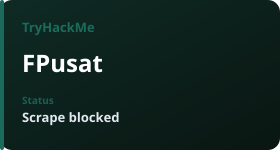
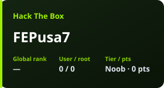
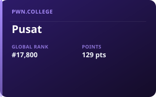
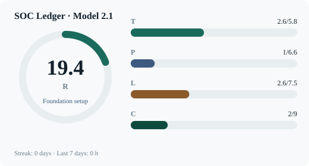
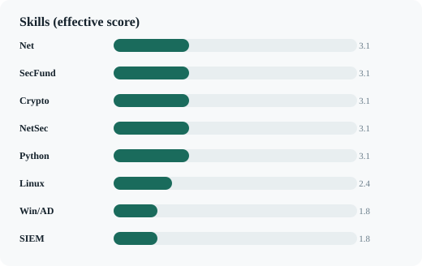
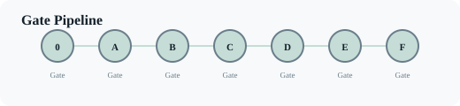

# 👋 Hello, I'm Faik Emre Pusat

### 🛡️ Aspiring Junior SOC Analyst / Blue Team Specialist
*Germany Junior SOC & Defensive Security Career Path · Formula and Data-Driven Competency Tracking*

---

## 🎯 Goals and Focus Area
I am preparing for **Junior SOC Analyst / Incident Responder** positions in Germany's cybersecurity ecosystem. Instead of a traditional calendar-based cramming approach, I apply the Model 2.1 system built on **measurable competency (R score)**, the **FSRS spaced repetition algorithm**, and **concrete lab evidence**.

---

## 🛠️ Technical Skills and Toolset

| Area | Tools & Technologies |
| :--- | :--- |
| **Defensive & SOC** |     |
| **Systems & Server** |   |
| **Network Security** |   |
| **Languages & Scripting** |   |

---

<!-- AUTO:PLATFORMS -->
## Platform Progress

*Lab platforms — auto-updated daily.*

<table align="center"><tr>
<td valign="top" align="center"></td>
<td valign="top" align="center"></td>
<td valign="top" align="center"></td>
</tr></table>
<!-- /AUTO:PLATFORMS -->

---

<!-- AUTO:DURUM -->
## SOC Ledger Dashboard

Model **2.1** · Updated Sep 1, 2026

[Live dashboard](https://faikemrepusat.github.io/cyber-security-training/) · [Source code](https://github.com/FaikEmrePusat/cyber-security-training)

<b>Charts</b>

| Dimension | Score | Target |
| :--- | ---: | ---: |
| Technical (T) | 2.9 | 5.8 |
| Production (P) | 1 | 6.6 |
| Language (L) | 2.6 | 7.5 |
| Career (C) | 2 | 9 |

**R:** 20.3 (Foundation setup) · **Streak:** 0 days · **Last 7 days:** 0 h

No gates open yet · next 0 %25 · bottleneck: Unknown — ETA conditional
<!-- /AUTO:DURUM -->

---

## 📊 System I Built: SOC Ledger (durum-web, Model 2.1)
The open-source cybersecurity competency tracking system I developed and use daily:

- 🧠 **FSRS Spaced Repetition:** Memory stability engine optimized for the forgetting curve.
- 📐 **Geometric Readiness Score ($R$):** Evidence-capped geometric mean of Technical ($T$), Production/Lab ($P$), Language ($L$), and Career ($C$) components.
- 🚦 **Gate Pipeline (0-F):** Legal equivalence, technical lab depth, public project evidence, and job application gate requirements.
- 🔄 **A/B Day Rhythm:** Topic Deepening and Comprehensive SOC Lab cycle that balances cognitive load.

👉 **[Explore Live Status Dashboard](https://faikemrepusat.github.io/cyber-security-training/)**

---

## 🌐 Languages & Communication
- 🇩🇪 **German:** B1/B2 Targeted Study (Junior Blue Team communication level)
- 🇬🇧 **English:** Technical & Professional Fluency (Documentation & Global Communication)

---

  <i>"Progress not measured by data is merely a guess."</i>

